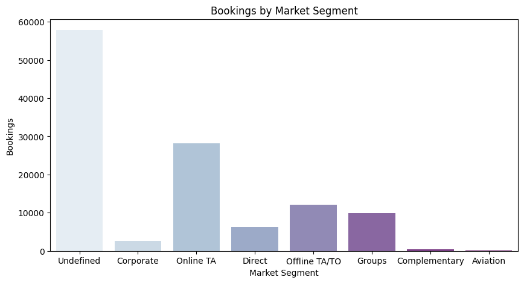
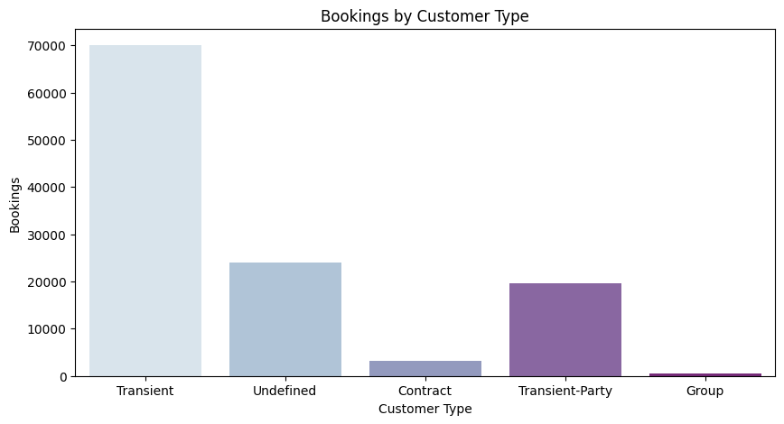
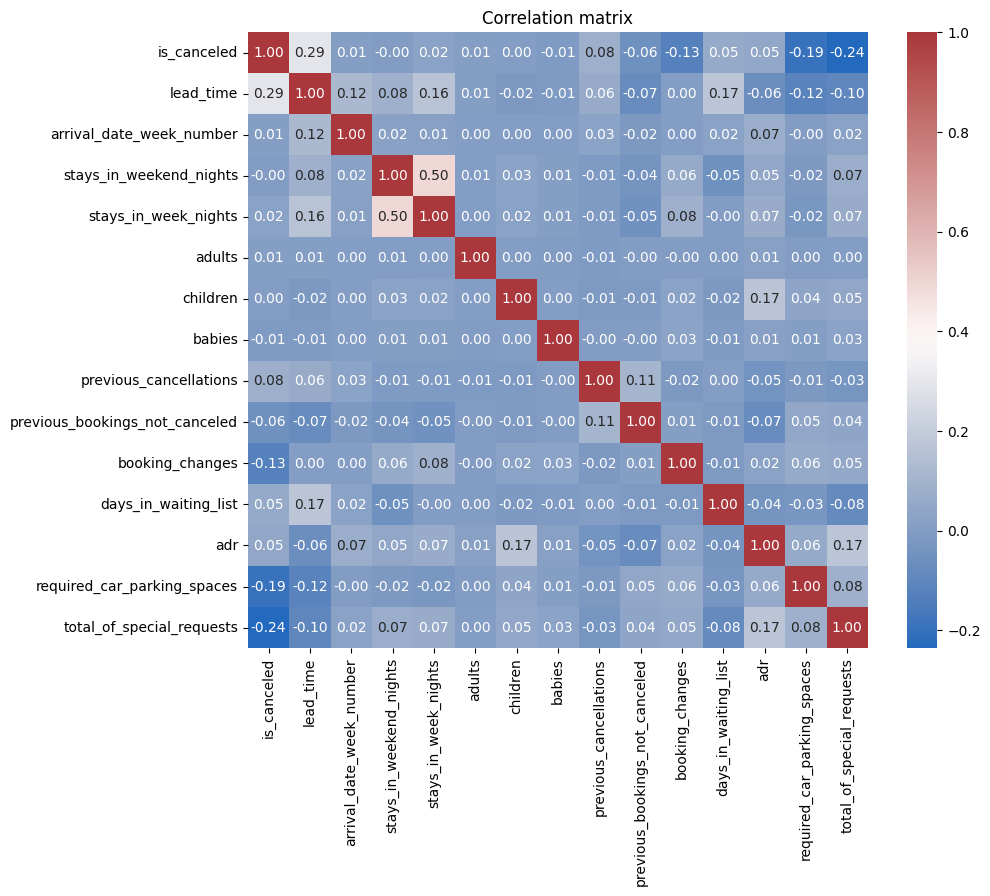
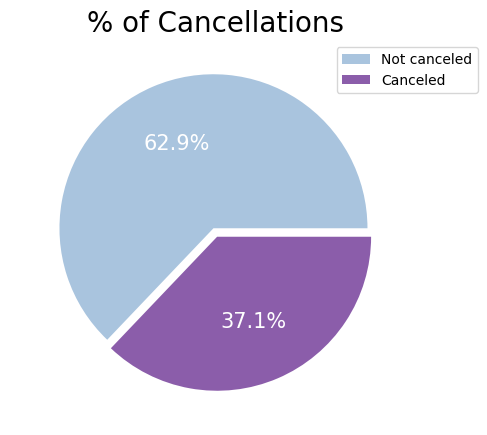
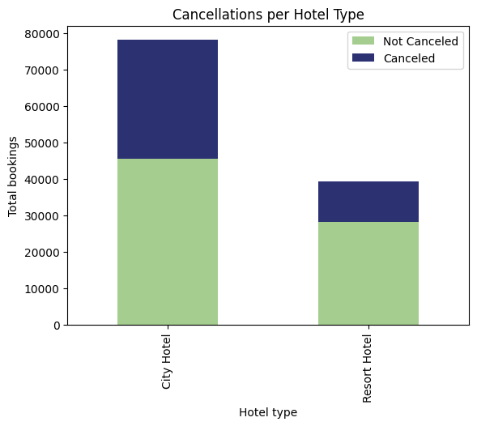
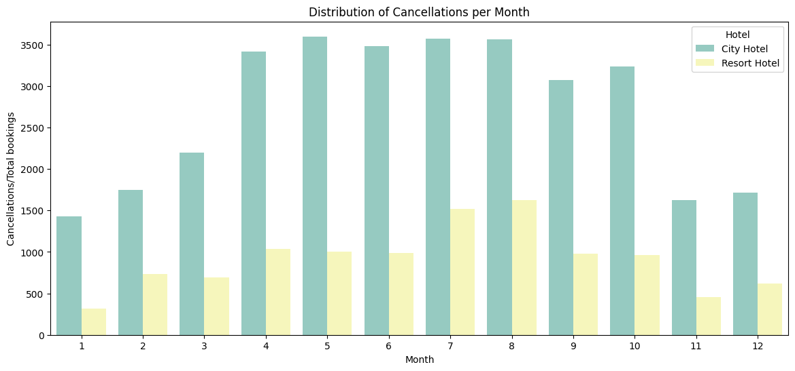

# Análisis de la tasa de cancelación de las reservas de los hoteles del grupo NOMERIUM

## Introducción
El sector hotelero se enfrenta a un reto cada vez mayor: el aumento de las cancelaciones de reservas. Esta tendencia, que se ha intensificado en los últimos años, genera un impacto negativo en los ingresos y la rentabilidad de los hoteles.

Para combatir este problema, resulta fundamental comprender las causas y patrones detrás de las cancelaciones. Es aquí donde el análisis de datos juega un papel crucial. Al analizar en profundidad los datos de las reservas canceladas, los hoteles pueden identificar áreas de mejora y tomar decisiones informadas para reducir la tasa de cancelación.

Este informe realizado por el grupo de trabajo "BYE BI" para el cliente ficticio NOMERIU en el marco del Bootcamp de Análisis de Datos de Adalab, tiene como objetivo analizar las cancelaciones de reservas de dos hoteles de un grupo hotelero. A través de la limpieza de datos, el análisis estadístico y la creación de visualizaciones y un cuadro de mando en Power BI se pretende identificar los factores que influyen en las cancelaciones y proponer estrategias para reducirlas.

El objetivo de este ánalisis es brindar información valiosa para comprender mejor las cancelaciones de reservas en el hotel. Los resultados obtenidos permitirán al hotel desarrollar estrategias efectivas para reducir la tasa de cancelación, mejorar la rentabilidad, anticiparse a picos de reserva, planificar sus recursos humanos y ofrecer al cliente una mejor experienica. 

Metodología:

El análisis se ha llevado a cabo siguiendo los siguientes pasos:

Limpieza de datos: Se ha revisado el conjunto de datos brindados por el cliente sobre las reservas para identificar y corregir errores, valores atípicos y datos faltantes.
Análisis descriptivo: Cálculo de  medidas de tendencia central, dispersión y distribución para comprender las características de las reservas canceladas.
Análisis estadístico: Pruebas estadísticas para identificar relaciones significativas entre las variables relevantes y la tasa de cancelación.
Visualización de datos: Se crearán gráficos y tablas con el objetivo de identificar patrones y tendencias. 
Creación de un cuadro de mando y base de datos: Se brinda al cliente un cuadro de mando asociado a una base de datos en SQL que permite la actualización diaria de los datos y obtener, en el día a día, una imagen del funcionamiento diario de los hoteles del grupo hoetlero. 
Conclusiones y recomendaciones: Se presentan adjuntas en este informe. 

Se espera que este análisis tenga un impacto positivo en el hotel al:

Reducir la tasa de cancelación de reservas: Al comprender las causas de las cancelaciones, el hotel podrá implementar estrategias para prevenirlas.
Mejorar la rentabilidad: Reducir las cancelaciones significa aumentar el número de reservas confirmadas y, por lo tanto, los ingresos del hotel.
Optimizar la experiencia del cliente: Al minimizar las cancelaciones, el hotel podrá ofrecer una experiencia más satisfactoria a sus huéspedes.

En definitiva, este análisis se presenta como una herramienta valiosa para que el hotel tome decisiones informadas y mejore su desempeño en un entorno competitivo.

# 1 LIMPIEZA DE DATOS

Como punto de partida del análisis se realizó una limpieza de los datos facilidados por el cliente con el objetivo de garantizar la calidad y robustez de los datos que serían utilizados en el informe. 

Esta limpieza incluye: 

    Cambios de tipo de datos: modificando aquellas columnas configuradas erroneamente. 
    Eliminación de columnas: se eliminan aquellas columnas con un alto número de errores o nulos. 
    Creación de nuevas columnas: courtesy de tipo booleano que indica que si el cliente se alojó en alguna habitación de cortería del hotel. Se añade también arrival_date resultado de combinar las columnas arrival_date_year, arrival_date_month y arrival_date_day_of_month en formato de fecha YYYY-MM-DD.

## Limpieza e imputación de nulos: 

Se realiza bajo los siguientes criterios: 

    - Eliminar las filas que tienen todos los valores nulos.
    -  Elimina las filas que tienen más del 80% de valores nulos.

## Imputación de nulos :
- Con la mediana en las columnas : arrival_date_day_of, arrival_date_week_number, arrival_date_year.
- Con cero en las columnas: arrival_date_month, children, previous_cancellations,   is_repeated_guest, reservation_status_date.
- Con undefined en las columnas : meal,country, market_segment, distribution_channel, agent, reserved_room_type, assigned_room_type, customer_type.
- Actualizar reservation_status_date, utilizando arrival_date_year, arrival_date_month y arrival_date_day_of_month cuando reservation_status_date'es 0.

# 2 ANÁLISIS PRELIMINAR DE LOS DATOS

Se realiza un análisis inductivo de la información facilitad analizando desde la generalidad de los datos aportados por el grupo hotelero hasta los detalles más concretos relacionados con las cancelaciones. A través de esta metodología podemos extraer progresimanete patrones dentro de la informacion faciliada. 

Objetivos planteados previos al análisis. 

        - Identificar los patrones en cancelaciones: comportamiento según tipo de habitación, origen del cliente y época del año. 
        - Causas de cancelación: incremento en el precio. 

Bajo las premisas anteriormente indicas se comienza a estudiar los datos propuestos. 

De las reservas de ambos hoteles se cancela un 37,1% de las mismas. 

En Abril de 2016, por fecha de llegada, se igualan las reservas canceladas a las no canceladas.
En Diciembre de 2016 vuelve a ocurrir estoy después de esa fecha, son más las cancelaciones que las reservas en el hotel.

## Top 10 de reservas no canceladas por país

| País | Número de reservas no canceladas |
|---|---|
| Undefined | 33179 |
| Portugal | 11458 |
| Reino Unido | 5184 |
| Francia | 4660 |
| España | 3499 |
| Alemania | 3318 |
| Irlanda | 1340 |
| Italia | 1336 |
| Bélgica | 1027 |
| Países Bajos | 939 |

De la tabla que se muestra se detecta que existe un gran volumen de reservas de las cuáles desconecemos el país de procedencia. Por otro lado, los clientes portugueses cancelan, con diferencia respecto a aquellos de Reino Unido, más de el doble. Se recomienda en este punto a NOMERIU revisar con el equipo de ingenería la extracción y origen de los datos obtenidos ya que reducir el volumen de Undefined conducirá, a futuro, a un mejor análisis y detención de la conducta de sus clientes. 

Observamos que **la mayoría de reservas a los hoteles se realizan con una antelación de no más de 50 días**. Conforme el plazo entre la reserva y la llegada aumenta, el número de reservas disminuye considerablemente.

Un elevado número de nuestros datos no tienen un segmento de mercado definido. Sería recomendable tratar de recoger la información de un modo en el que no se perdieran tantos datos. Aún así, respecto a la información de la que disponemos: La mayoría de reservas pertenecen al segmeneto de mercado Online TA.

En este caso se observa que la mayoría de clientes pertenecen a la categoría de **transient**, entendido como "un tipo de cliente que realiza reservas individuales y que no forma parte de un grupo o contrato a largo plazo". 

Con el objetivo de tener una visión global de la situación del hotel y la correlación de las diferentes variables ante el volumen de cancelaciones se realiza un gráfico de correlación: 

Según el gráfico de correlación, existe una relación moderada positiva entre las variables `stays_in_weekend_nights` y `stays_in_week_nights`. Cuando una aumenta, la otra tiende a aumentar también.
Otras correlaciones positivas interesantes, aunque débiles, son:
- `lead_time` y `days_in_waiting_list`
- `lead_time`y `stays_in_week_nights`
- `children` y `adr`
- `adr` y `total_of_special_requests`

# 3 ANÁLISIS SOBRE LAS CANCELACIONES

Tras obtener una visión sobre la situación del hotel se realiza un análisis detallado sobre las cancelaciones. 

El porcentaje de cancelaciones es de **37,5%**, un número que podría considerarse relativamente alto. Para conocer el motivo tras ese resultado, primero realizaremos un análisis general de los datos y en base al mismo iremos profundizando en distintas variables.

En cuanto al hotel que sufre un mayor número de cancelaciones se concluye que el 'City Hotel' obtiene un alto número de reservas pero el número de cancelaciones no sería proporcionado, en comparación con las cancelaciones del Resort Hotel: 

Por ello, el análisis sobre las cancelaciones a continuación detallado se basará en el primero de los hoteles mencionados ya que se identifica que puede ser el foco del problema planteado por nuestro cliente al sufrir un 41,8% de cancelaciones sobre el volumen total de reservas. 

Las cancelaciones se intensifican edurante el período estival y llegan a superar, por momentos, a las reservas no canceladas: 

Dado que en el análisis realizado previamente se detectó que el país con un mayor volumen de cancelaciones es 'Portugal' se realizó un estudio a detalle de la evolución de las cancelaciones para este país: 

A partir de junio 2015 los clientes procedentes de este país comenzaron a cancelar sus reservas de forma drástica. 

También se realizó un estudio de los agentes encargados de gestionar las reservas del total de clientes detectando que para el Hotel City son el agente 1 y 9 los que mueven un mayor volumen de reservas. Por ello, se procede a continuación a recoger las conclusiones extraidas sobre ambos agentes: 

El agente nueve cuenta con un 41,5% de reservas canceladas: 

Mientras que el agente 1 tiene una tasa de cancelación del 26,6% de sus reservas: 

El agente 1 es el que mueve un mayor número de reservas: 

El precio es uno de los atributos de un producto o servicio que supone una mayor sensibilidad e impacto en el comportamiento del cliente, por ello, se compara a continuación la variación de las tarifas aplicadas por ambos agentes: 

# 4 CONCLUSIONES

Uno de los principales rectos a los que se enfrenta el sector hotelero y que se ven reflejado en los datos facilitados por el cliente es el aumento de las cancelaciones. Una tendencia que se ha intensificado en los últimos años y que genera un impacto negativo en los ingresos y rentabilidad de los hoteles. 

Resulta prioritario conocer las causas y patrones detrás de las cancelaciones. Tras la información previamente recogida se concluye: 

La tasa de cancelación general para ambos hoteles es del 37,1%.
El Hotel City tiene una tasa de cancelación del 41,8%, mientras que el Resort Hotel tiene una tasa del 32,8%.
Las cancelaciones se intensifican durante el período estival, llegando a superar en algunos momentos a las reservas no canceladas en el Hotel City.
Portugal es el país con mayor tasa de cancelación, con un 50,7% de cancelaciones en el Hotel City.
El agente 9 tiene una tasa de cancelación del 41,5% en el Hotel City.
El agente 1 tiene una tasa de cancelación del 26,6% en el Hotel City.
El agente 9 aplica tarifas más altas que el agente 1, lo que podría estar relacionado con la mayor tasa de cancelación.
La mayoría de las reservas se realizan con una antelación de no más de 50 días.
El segmento de mercado más frecuente es Online TA.
La mayoría de los clientes son de tipo "transient".
Existe una correlación moderada positiva entre las variables stays_in_weekend_nights y stays_in_week_nights.
Las cancelaciones se concentran en habitaciones dobles.

Se recomienda a NOMERIU:

Investigar las causas de la alta tasa de cancelación de clientes portugueses en el Hotel City a partir de junio de 2015.
Implementar estrategias para reducir las cancelaciones en general, especialmente durante el período estival.
Mejorar la recogida de datos de país de origen de los clientes.
Considerar la posibilidad de ofrecer tarifas dinámicas en función de la demanda y el tipo de cliente.
Realizar un seguimiento continuo de las tasas de cancelación y tomar medidas correctivas en caso necesario.

Beneficios perseguidos de aplicar estas recomendaciones: 

Reducción de la tasa de cancelación de reservas.
Mejora de la rentabilidad del hotel.
Mayor capacidad de anticipación a picos de reserva.
Optimización de la planificación de recursos humanos.
Mejora de la experiencia del cliente.
